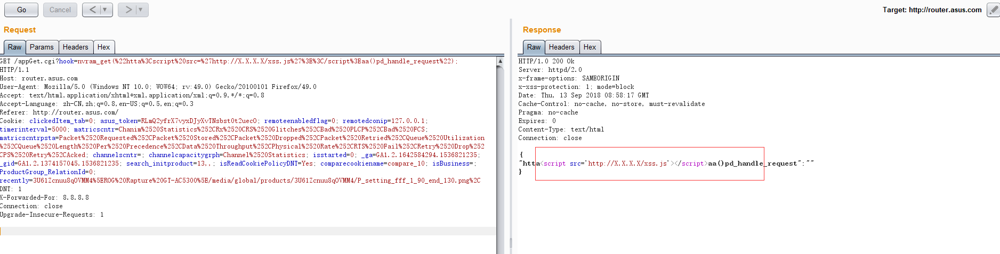

# ASUS GT-AC5300 Cross Site Scripting(xss) #

**vender** ：ASUS

**Firmware version**: <=3.0.0.4.384_32738

**Exploit Author**: bigbear@galaxylab.org

**Vendor Homepage**: https://www.asus.com

**Hardware Link**:https://www.asus.com/Networking/ROG-Rapture-GT-AC5300/HelpDesk_BIOS/

## Vul detail ##

Reproduction Steps:
1. Go to your wi-fi router gateway [i.e: http://router.asus.com]
1. login with admin
1. Send http request with admin cookies and referer(http://router.asus.com/)

