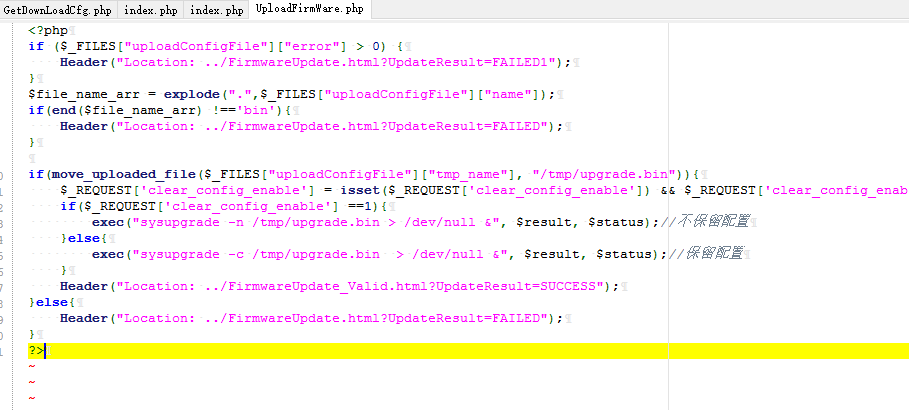

# D-Link DIR-846 Unauthorized upload of FirmWare file #

**vender** ：D-Link

**Firmware version**:100.26

**Exploit Author**: bigbear@galaxylab.org

**Vendor Homepage**: http://www.dlink.com.cn/

**Hardware Link**:http://support.dlink.com.cn/ProductInfo.aspx?m=DIR-846

## Vul detail ##

1. The vulnerable code is in file /squashfs-root/www/HNAP1/UploadFirmWare.php.

