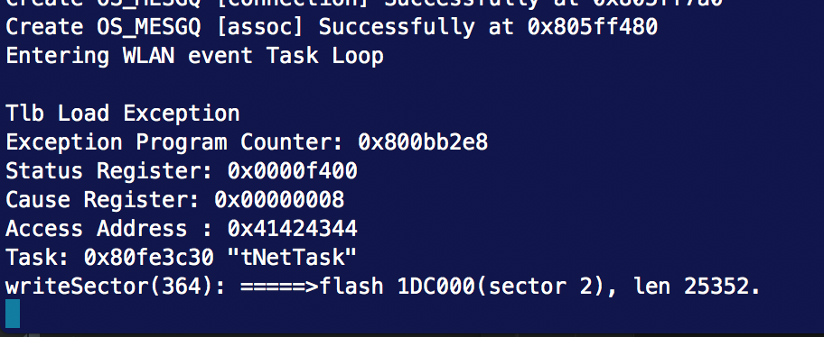
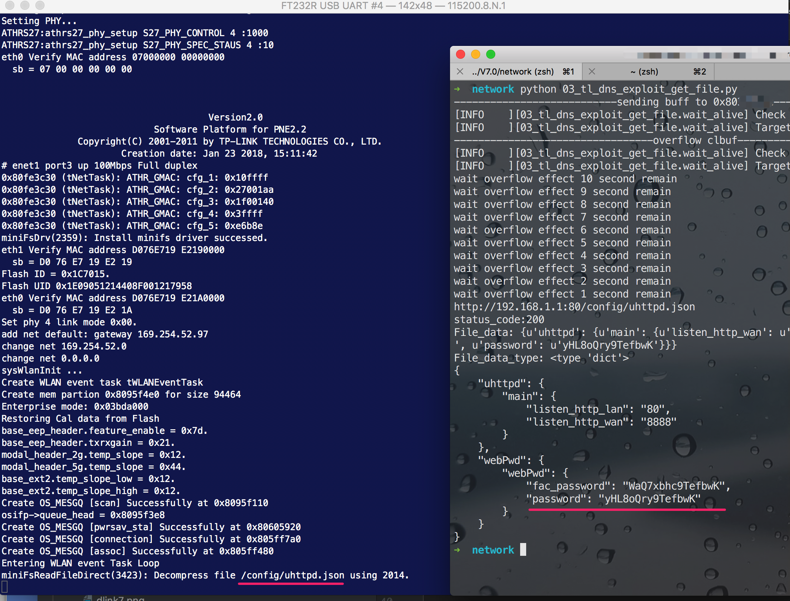

# TP-Link WR886N V7 Dns Request buff Overflow 

**Vender**：TP-Link

**Firmware version**: 1.1.0

**Hardware version**: TL-WR886N 7.0

**Exploit Author**: lbp@galaxylab.org

**Vendor Homepage**: http://www.tp-link.com.cn/

**Hardware Link**:http://www.tp-link.com.cn/product_397.html

## Vul detail ##
Specially crafted packets to port 53/udp could cause a buff overflow in the affected products. An successful exploit can cause a denial of service (device reboot) or possibly execute arbitrary code.

Attacker can use this vulnerability to modify system code, directly get the admin password hash using http request.

By default the router didn't allow user to directly read system file using http request. It will Add `/web` to your request PATH, if you request `http://192.168.1.1/test.html` the router will read `/web/test.html` from minifs.

After exploit the system code is modified, the router will directly read the file you request. So you can read any config file you want.

